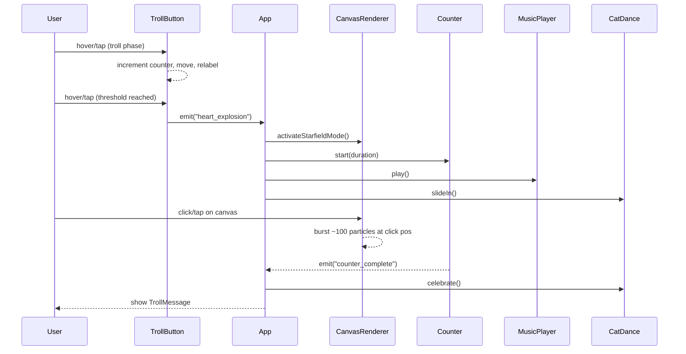

# Design Document — million-hearts-landing

## Overview

`million-hearts-landing` là một single-page landing page viết hoàn toàn bằng vanilla HTML/CSS/JavaScript (không framework, không dependency ngoài). Mục tiêu kỹ thuật cốt lõi là hiển thị 1.000.000 heart particles mượt mà trong trình duyệt, kết hợp với các thành phần UI hài hước: Troll Button, Cat Dance, Music Player và Counter. Toàn bộ logic được đóng gói trong một file `index.html` duy nhất.

**Nguyên tắc kỹ thuật chủ đạo:**
- Performance-first: Canvas API + TypedArrays + object pooling để xử lý 1M particles
- No-dependency: Không CDN, không npm — chỉ có Web Platform APIs
- Progressive interaction: Autoplay policy tuân thủ, troll trước khi cho tương tác

---

## Architecture

Toàn bộ ứng dụng nằm trong một file `index.html`. Code JavaScript được tổ chức theo module pattern (IIFE hoặc ES Modules dùng `<script type="module">`) gồm các module độc lập, giao tiếp qua một event bus đơn giản hoặc shared state object.

```
index.html
├── <style>          — Toàn bộ CSS (reset, layout, animations, responsive)
└── <script>
    ├── EventBus     — Pub/sub đơn giản để decoupled communication
    ├── ParticlePool — Object pool quản lý 1M Particle TypedArrays
    ├── CanvasRenderer — requestAnimationFrame loop, draw calls
    ├── StarfieldMode  — Twinkle, depth layers, shooting stars
    ├── TrollButton    — State machine: init → troll×N → unlock
    ├── Counter        — easeOutQuad animation 0→1,000,000
    ├── CatDance       — CSS animation controller, BPM sync
    ├── MusicPlayer    — HTMLAudioElement, localStorage persistence
    └── App            — Orchestrator, wires everything together
```

### Data Flow



---

## Components and Interfaces

### 1. ParticlePool

Quản lý 1.000.000 Particle bằng TypedArrays (Float32Array, Uint8Array) để tránh GC pressure.

```javascript
// Mỗi particle lưu trong parallel arrays (SoA — Structure of Arrays)
const pool = {
  x:            new Float32Array(MAX_PARTICLES),
  y:            new Float32Array(MAX_PARTICLES),
  vx:           new Float32Array(MAX_PARTICLES),
  vy:           new Float32Array(MAX_PARTICLES),
  size:         new Float32Array(MAX_PARTICLES),
  alpha:        new Float32Array(MAX_PARTICLES),
  twinklePhase: new Float32Array(MAX_PARTICLES),
  twinkleFreq:  new Float32Array(MAX_PARTICLES),
  depthLayer:   new Uint8Array(MAX_PARTICLES),  // 0=far, 1=mid, 2=near
  colorIndex:   new Uint8Array(MAX_PARTICLES),  // index vào COLOR_PALETTE
  active:       new Uint8Array(MAX_PARTICLES),  // 0 hoặc 1
};

interface ParticlePool {
  init(count: number): void;          // khởi tạo batch, non-blocking
  recycle(index: number): void;       // reset particle về trạng thái mới
  getActiveCount(): number;
}
```

**Design Decision:** Dùng SoA (Structure of Arrays) thay vì AoS (Array of Structures) vì SoA cho phép CPU cache line locality tốt hơn khi update từng thuộc tính trên toàn bộ pool.

### 2. CanvasRenderer

```javascript
interface CanvasRenderer {
  init(canvasElement: HTMLCanvasElement): void;
  startLoop(): void;
  stopLoop(): void;
  activateStarfieldMode(): void;
  burstAt(x: number, y: number, count: number): void;
  resize(width: number, height: number): void;
}
```

Vòng lặp animation:
```javascript
function animationLoop(timestamp) {
  ctx.clearRect(0, 0, canvas.width, canvas.height);
  drawBackground();          // gradient tối
  updateParticles(timestamp); // cập nhật vị trí, twinkle, recycle
  drawParticles();            // batch draw tất cả active particles
  drawShootingStars();
  requestAnimationFrame(animationLoop);
}
```

### 3. TrollButton

State machine với 3 state: `idle` → `trolling` → `unlocked`

```javascript
interface TrollButton {
  init(): void;               // set threshold random [3,5], counter=0
  onHover(event): void;       // troll logic
  onTouch(event): void;       // mobile troll logic
  onClick(event): void;       // chỉ fire nếu state === 'unlocked'
}
```

Troll messages pool:
```javascript
const TROLL_MESSAGES = [
  "Không phải đây! 😏",
  "Gần rồi~",
  "Thử lại nào!",
  "Hehe 😈",
  "Trốn rồi!",
];
```

### 4. Counter

```javascript
interface Counter {
  start(duration: number): void; // duration trong ms, [3000, 8000]
  format(n: number): string;     // "1,000,000" với thousand separators
  onComplete(callback: () => void): void;
}
```

Easing function:
```javascript
// easeOutQuad: f(t) = t * (2 - t), t ∈ [0, 1]
function easeOutQuad(t) {
  return t * (2 - t);
}
function getCounterValue(elapsed, duration) {
  const t = Math.min(elapsed / duration, 1);
  return Math.floor(easeOutQuad(t) * 1_000_000);
}
```

### 5. CatDance

```javascript
interface CatDance {
  slideIn(): void;
  syncBPM(bpm: number): void;     // sets CSS animation-duration = 60000/bpm ms
  celebrate(): void;               // chuyển sang celebration animation
  fadeOut(): void;
}
```

### 6. MusicPlayer

```javascript
interface MusicPlayer {
  init(src: string): void;        // src là base64 data URI hoặc local path
  play(): void;
  pause(): void;
  toggle(): void;
  isPlaying(): boolean;
  loadState(): void;              // từ localStorage
  saveState(): void;              // vào localStorage
}
```

### 7. EventBus

```javascript
interface EventBus {
  on(event: string, handler: Function): void;
  off(event: string, handler: Function): void;
  emit(event: string, data?: any): void;
}
```

Events:
| Event | Emitter | Listeners |
|---|---|---|
| `heart_explosion` | TrollButton | App |
| `counter_complete` | Counter | App, CatDance |
| `music_toggle` | MusicPlayer | CatDance |
| `canvas_click` | CanvasRenderer | CanvasRenderer |

---

## Data Models

### Particle Properties

| Thuộc tính | Kiểu | Khoảng giá trị | Mô tả |
|---|---|---|---|
| `x` | Float32 | [0, canvas.width] | Vị trí ngang |
| `y` | Float32 | [0, canvas.height] | Vị trí dọc |
| `vx` | Float32 | [-2, 2] | Vận tốc ngang (px/frame) |
| `vy` | Float32 | [-2, 2] | Vận tốc dọc (px/frame) |
| `size` | Float32 | [4, 28] | Kích thước theo depth_layer |
| `alpha` | Float32 | [0.0, 1.0] | Độ trong suốt |
| `twinklePhase` | Float32 | [0, 2π] | Phase hiện tại của sin |
| `twinkleFreq` | Float32 | [0.01, 0.05] | Tần số nhấp nháy (rad/frame) |
| `depthLayer` | Uint8 | {0, 1, 2} | 0=far, 1=mid, 2=near |
| `colorIndex` | Uint8 | [0, 3] | Index vào COLOR_PALETTE |
| `active` | Uint8 | {0, 1} | 1 nếu đang render |

### Depth Layer Specification

| Layer | depthLayer | Size (px) | Speed multiplier |
|---|---|---|---|
| Xa | 0 | 4–8 | 0.3–0.5× |
| Giữa | 1 | 9–16 | 0.6–0.8× |
| Gần | 2 | 17–28 | 0.9–1.5× |

### Color Palette

```javascript
const COLOR_PALETTE = [
  '#ffffff',  // white
  '#ffb3c6',  // pink
  '#ff6b9d',  // hot pink
  '#ffd700',  // gold
];
```

### TrollButton State

```javascript
{
  state: 'idle' | 'trolling' | 'unlocked',
  trollCounter: number,    // 0 đến threshold
  threshold: number,       // random [3, 5]
  messageIndex: number,    // index hiện tại trong TROLL_MESSAGES
}
```

### MusicPlayer State (localStorage key: `mhl_music_on`)

```javascript
{
  isPlaying: boolean,  // lưu vào localStorage
}
```

### Shooting Star

```javascript
{
  particles: number[],  // 5–10 indices trong particle pool
  direction: { dx: number, dy: number }, // normalized direction vector
  speed: number,        // px/frame, cao (8–15)
  lifetime: number,     // 0.5–1s tính bằng frames
}
```

---

## Correctness Properties

*A property is a characteristic or behavior that should hold true across all valid executions of a system — essentially, a formal statement about what the system should do. Properties serve as the bridge between human-readable specifications and machine-verifiable correctness guarantees.*

### Property 1: Particle Invariants

*For any* particle initialized in the pool, it must have all required properties (x, y, vx, vy, size, alpha, twinklePhase, twinkleFreq, depthLayer, colorIndex, active) with values within their valid ranges: size within the range specified for its depthLayer, alpha within [0, 1], colorIndex within [0, 3], and depthLayer within {0, 1, 2}.

**Validates: Requirements 2.2, 3.2, 3.4**

---

### Property 2: Twinkle Alpha Range

*For any* twinklePhase value in [0, 2π] and any twinkleFreq value in [0.01, 0.05], the computed alpha value (using the formula `0.35 + 0.65 * (0.5 + 0.5 * sin(twinklePhase))`) must always fall within [0.3, 1.0].

**Validates: Requirements 3.3**

---

### Property 3: Shooting Star Particle Count

*For any* generated Shooting_Star, the number of constituent particles must be in the range [5, 10] and their sizes must be monotonically non-increasing in the direction of travel (trailing particles are smaller than leading particles).

**Validates: Requirements 3.6**

---

### Property 4: Particle Pool Size Invariant (Recycling)

*For any* frame of the animation loop, the total number of particles in the pool (active + inactive) must remain equal to the initial pool size. When a particle goes out-of-bounds or reaches alpha ≤ 0, it must be recycled (marked inactive and reset), not destroyed and replaced with a new allocation.

**Validates: Requirements 3.7**

---

### Property 5: Counter Monotonicity and Completion

*For any* configured duration `d` in [3000ms, 8000ms], the counter value at any time `t` must be monotonically non-decreasing, the value at `t=0` must be 0, and the value at `t=d` must be exactly 1,000,000. Additionally, for any two times `t1 < t2` both within the duration, `counter(t1) ≤ counter(t2)`.

**Validates: Requirements 4.1, 4.3**

---

### Property 6: Counter Thousand-Separator Formatting

*For any* integer `n` in [0, 1,000,000], `formatCounter(n)` must produce a string where every group of three digits from the right is separated by a consistent separator character (comma or period), and the numeric value represented must equal `n`.

**Validates: Requirements 4.2**

---

### Property 7: Canvas Resize Matches Viewport

*For any* viewport width `w` and height `h` (positive integers), after calling `renderer.resize(w, h)`, the canvas element's `width` attribute must equal `w` and its `height` attribute must equal `h`.

**Validates: Requirements 5.2**

---

### Property 8: Troll Counter Increment Invariant

*For any* sequence of `k` hover/tap events on the Troll_Button where the current troll counter is less than the threshold before each event, the troll counter must equal `k` after those events, and the threshold must remain unchanged (in [3, 5]) throughout.

**Validates: Requirements 6.1, 6.2**

---

### Property 9: Troll Label From Predefined Set

*For any* troll event (hover/tap when counter < threshold), the button label after the event must be one of the strings in `TROLL_MESSAGES` (a predefined, finite set).

**Validates: Requirements 6.3**

---

### Property 10: BPM to Animation Duration Mapping

*For any* BPM value `b > 0`, the CSS `animation-duration` set by `syncBPM(b)` must equal `60000 / b` milliseconds (i.e., one full beat cycle per animation iteration).

**Validates: Requirements 7.4**

---

### Property 11: Music State localStorage Persistence

*For any* sequence of toggle actions on the MusicPlayer, after each toggle the value stored in `localStorage['mhl_music_on']` must equal the current `isPlaying` state. The stored state must survive a simulated page reload (read-back from localStorage must match the last saved state).

**Validates: Requirements 8.7**

---

## Error Handling

| Scenario | Handling |
|---|---|
| Canvas API không hỗ trợ | Hiển thị `<div id="fallback">` với thông báo friendly thay canvas |
| Autoplay bị chặn | Catch Promise rejection từ `audio.play()`, hiển thị "🎵 Nhấn để bật nhạc" overlay |
| `localStorage` không khả dụng (private browsing) | Try/catch; fall back to in-memory state, không crash |
| `requestAnimationFrame` không có | Polyfill bằng `setTimeout(fn, 16)` |
| Particle pool cạn | Recycle oldest inactive particle; không throw error |
| Viewport resize khi animation đang chạy | `ResizeObserver` / `window.onresize` → canvas.width/height update; particles ra ngoài viewport được recycle ngay |

---

## Testing Strategy

### Dual Testing Approach

Bởi vì đây là vanilla JavaScript trong một single HTML file, testing strategy sẽ dùng:
- **Unit tests** (Vitest hoặc Jest với jsdom): cho pure logic modules (Counter, TrollButton state machine, ParticlePool, formatCounter)
- **Property-based tests** (fast-check): cho các property được định nghĩa ở trên
- **Integration tests** (Playwright hoặc Cypress): cho user interaction flows

### Unit Testing (Example-based)

Viết unit tests cho các trường hợp cụ thể:

| Test case | Module |
|---|---|
| Troll_Button ở trạng thái `unlocked` cho phép click | TrollButton |
| Counter hiển thị "0" khi start | Counter |
| Counter dừng lại và hiển thị Troll_Message khi đạt 1M | Counter |
| Music toggle cập nhật icon đúng | MusicPlayer |
| Canvas fallback hiển thị khi Canvas không hỗ trợ | CanvasRenderer |
| Autoplay rejection hiển thị overlay nhạc | MusicPlayer |
| Cat_Dance slide-in khi heart_explosion fire | CatDance |

### Property-Based Tests (fast-check)

Dùng **[fast-check](https://github.com/dubzzz/fast-check)** (JavaScript PBT library). Mỗi test chạy tối thiểu **100 iterations**.

```
Tag format: // Feature: million-hearts-landing, Property {N}: {property_text}
```

| Property | Test | Iterations |
|---|---|---|
| P1: Particle Invariants | Arbitrary particle config → verify all field ranges | 200 |
| P2: Twinkle Alpha Range | Arbitrary twinklePhase ∈ [0, 2π] → alpha ∈ [0.3, 1.0] | 500 |
| P3: Shooting Star Particle Count | Arbitrary shooting star → 5–10 particles, decreasing size | 200 |
| P4: Pool Size Invariant | Arbitrary sequence of recycle events → pool size constant | 100 |
| P5: Counter Monotonicity | Arbitrary duration ∈ [3000, 8000] → monotonic, reaches 1M | 100 |
| P6: Format Thousand Separator | Arbitrary n ∈ [0, 1000000] → correct formatted string | 1000 |
| P7: Canvas Resize | Arbitrary (w, h) positive integers → canvas matches | 200 |
| P8: Troll Counter Increment | Arbitrary k hovers < threshold → counter = k | 300 |
| P9: Troll Label From Set | Arbitrary troll event → label ∈ TROLL_MESSAGES | 200 |
| P10: BPM to Duration | Arbitrary BPM > 0 → duration = 60000/BPM ms | 500 |
| P11: Music localStorage | Arbitrary toggle sequence → localStorage matches state | 200 |

### Integration Tests (Playwright)

Kiểm tra end-to-end user flows:
1. Hover Troll_Button N lần → button unlocks → click → intro hides, canvas animates, counter starts, music starts
2. Click canvas → burst particles appear at click position
3. Counter reaches 1,000,000 → troll message shows, cat dance celebrates
4. Reload page → music state restored from localStorage
5. Resize window → canvas dimensions update
6. Mobile simulation → troll triggers on touchstart
